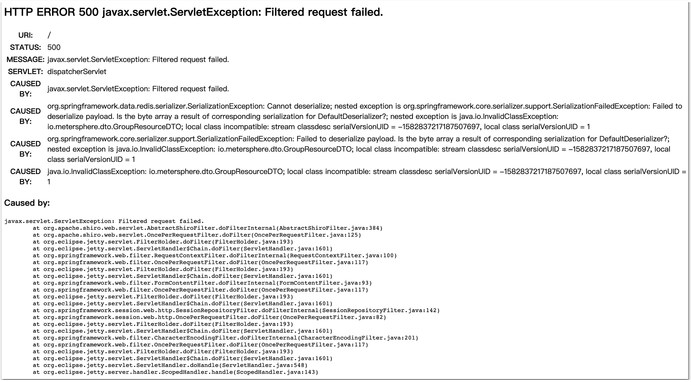

## 1 重启安装服务器后，如何启动 MeterSphere 相关组件？

MeterSphere 在安装过程中没有配置 docker 及其相关容器的自启动。当用户重新启动部署服务器之后，需要手动启动 docker 服务及 MeterSphere 相关容器。

```bash
service docker start
msctl start
msctl status
```

## 2 如何修改应用的默认端口？

修改 /opt/metersphere/.env 文件中的对应配置后，执行 `msctl reload` 命令重新加载应用。

> 配置文件说明请参考 [修改安装配置(可选)](/installation/online_installation/#32)。

## 3 如何在 Kubernetes 中搭建 MeterSphere？

可以参照我们提供的 [helm chart](https://github.com/metersphere/helm-chart)。
详见在线文档/安装部署/Kubernetes中部署：https://metersphere.io/docs/installation/kubernetes_installation/

## 4 docker-compose 版本与配置文件不兼容，请重新安装最新版本的 docker-compose?

把安装包里的docker-compose-xx 在 安装目录替换下。

## 5 升级指定版本

msctl upgrade 后边跟版本号，如 msctl upgrade v1.10.6-lts 。

## 6 卸载命令

msctl uninstall -v 

## 7 重新安装命令

进入到安装包，然后重新执行 ./install.sh 。

## 8 卸载会导致数据清空么？

卸载不会影响数据

## 9 升级报 `/usr/local/bin/msctl: line 115 ....`

cat /usr/local/bin/msctl 查看这个文件对应行数的代码，并进行相关处理。

## 10 升级报 `Schema ` metersphere `contains a faied migration to version 86 !`

到github源码上 https://github.com/metersphere/metersphere/tree/master/backend/src/main/resources/db/migration
查看对应version的flyway sql记录，和当前数据库比对，看具体哪行sql执行失败了，然后重新执行下，然后修改metersphere_version
表对应版本的的success值为1，然后 msclt reload 重启服务即可。

## 11 如何备份数据库?

```
docker exec -i mysql mysqldump -uroot -pPassword123@mysql metersphere > metersphere.sql
```

## 12 mysqldump: `Error 2020: Got packet bigger than 'max_allowed_packet' bytes when dumping table `api_scenario_report_detail` at row: 94`

```
添加max_allowed_packet参数，如下。
docker exec -i mysql mysqldump -uroot -pPassword123@mysql metersphere --max_allowed_packet=2G > metersphere.sql
```

## 13 关于"Log4j2远程代码执行漏洞"的修复

由于 MeterSphere 使用到的 Kafka 及依赖的 JMeter 会受此漏洞的影响，在 Kafka 及 JMeter 发布解决该漏洞的版本前，用户可以手动在 docker compose 文件 (docker-compose-kafka.yml，docker-compose-node-controller.yml 及 docker-compose-server.yml) 里添加 `FORMAT_MESSAGES_PATTERN_DISABLE_LOOKUPS: 'true'` 环境变量规避此问题。

具体修改方式请参考该 [GitHub Commit](https://github.com/metersphere/installer/commit/36a60b09117d17735eeadc36af2dc9b5e67a54f7?diff=unified)，修改完成后执行 `msctl reload` 命令重建容器使环境变量生效。

## 14 性能测试时并发量加大的时候报错Non HTTP response code: java.net.SocketTimeoutException

修改单个接口的连接超时时间。

## 15 数据库如何不区分大小写

chmod 655 /opt/metersphere/conf/my.cnf 

修改完成后，重启数据库。

## 16 docker-compose 版本与配置文件不兼容，提示请重新安装最新版本的 docker-compose。

可以把安装包里的docker-compose-xx 在安装目录替换一下。

## 17 设置数据库忽略大小未生效，lower_case_table_names=1

```
chmod /opt/metersphere/conf/my.cnf 
然后重启数据库 docker restart mysql
```

## 18 如何删除kafka中的临时数据，减低磁盘使用率
```
docker stop kafka；
docker stop zookeeper；
docker rm kafka；
docker rm zookeeper；
rm -rf /opt/metersphere/data/kafka/kafka；
rm -rf /opt/metersphere/data/zookeeper/zookeeper；
msctl reload；
```

## 19 执行机经常报内存溢出 Terminating due to java.lang.OutOfMemoryError: GC overhead limit exceeded
```
增大堆内存:
set JAVA_OPTS=-server -Xms512m -Xmx1024m -XX:MaxNewSize=1024m -XX:MaxPermSize=1024m;
```

## 20 jenkins插件验证通过后找不到工作空间
检查地址，地址里多了/login路径会出现这个现象

## 21 jar包存储位置
/opt/metersphere/data/jar

## 22 升级或安装时后台报错:image not found : xxxxxx；
需要在执行机上docker pull该镜像，或下载完整离线安装包；

## 23 前端执行性能测试或接口场景报错：请检查当前站点url配置；
本地搭建的可能要把localhost改为具体IP；

## 24 部署和升级时后台报错：error: ms-data-streaming is unhealthy； error:encountered errors while bringing up the project；
msctl uninstall卸载，ifconfig检查多余网桥，brctl delbr 网桥名称 删除多余网桥，msctl reload重启；

## 25 怎样监控被压测的机器
在被测服安装node-exporter服务，然后在性能测试中高级配置里添加监控，填写被测服node-exporter服务的ip和端口以及监控项

## 26 忘记 Metersphere密码
```
进入容器: docker exec -it mysql bash，再登录mysql -uroot -pPassword123@mysql
使用数据库: use metersphere;
更新密码为metersphere: update user set password='3259a9d7f208ef9690025d1432558c5b' where id='admin';
```

## 27 日志报缺少某些类的属性
这种情况大概率是安装包不全，或者镜像版本不一致导致的，可以重新下载安装包来进行镜像替换后或者重新安装来解决；

## 28 系统运行一段时间后磁盘可以清理哪些东西来释放磁盘
```
1.可以删除多余的镜像；
2.可以删除历史log文件；
3.如果没任务执行时可以删除/opt/metersphere/data/kafka/kafka和/opt/metersphere/data/zookeeper/zookeeper目录，并重启服务；
4.可以删除多余安装包和解压包；
```

## 29 MS部署中遇到Prometheus启动不起来，一直处于Restarting的问题
```
chmod -R 755 /opt/metersphere/conf/prometheus
docker stop ms-prometheus
docker rm ms-prometheus
msctl reload
```

## 30 遇到redis启动不起来，一直处于Restarting的问题
```
chmod -R 755 /opt/metersphere/conf/redis.conf
docker stop redis
docker rm redis
msctl reload
```

## 31 Redis无法连接
```
1.查看防护墙是否开启，如果防火墙开启了，查看6379端口是否开放，查看.env文件中配置的Redis地址是否是对于的服务器的IP地址；
2.可以开放6379端口或者关闭防火墙后重启服务；
3.确认日志中连不上的ip是redis的ip(Mac: ifconfig |grep "inet"|grep -v 127.0.0.1; Linux: hostname -I)
```

## 32 安装metersphere遇到内核之类的问题如何解决？docker: Error response from daemon: OCI runtime create failed: systemd cgroup flag passed。。。
```
1. 打开daemon.json文件, vi /etc/docker/daemon.json
2. 将"exec-opts": ["native.cgroupdriver=systemd"]删掉即可, 重启docker：service docker restart
3. 重启服务，msctl reload
```

## 33 环境变量和场景变量，用同个变量名，变量优先级是怎样的
环境变量 < 整体的场景变量 < 步骤内变量< 步骤原场景变量（如勾选）

## 34 遇到MYSQL连接数太多如何处理？java.sql.SQLNonTransientConnectionException: Data source rejected establishment of connection, message from server, too many connection
```
大概率是自带的my.cnf没有生效，没生效的原因为my.cnf文件权限不对：
show variables like "max_connections"
chmod -R 655 /opt/metersphere/conf/my.cnf
docker stop mysql
docker rm mysql
msctl reload
```

## 35 后台日志出现SQLSyntaxErrorException：Expression #3 of SELECT list is not in GROUP BY clause and contains nonaggregated column “metersphere” _dev.api_definition_exec_result.start_time’
修改环境中的数据库配置文件。 sql_mode=STRICT_TRANS_TABLES,NO_ZERO_IN_DATE

## 36 前后置SQL脚本执行报错： javax.net.ssl.SSLHandshakeException: No appropriate protocol ；
在数据库后面添加 ?createDatabaseIfNotExist=true&useSSL=false；

## 37 msctl status显示服务正常，但是实际服务却访问不了怎么办？
```
清浏览器缓存，关闭浏览器重新访问
IP访问：检查防火墙（firewalld,iptables等）
域名访问：检查防火墙及NGINX等网络相关配置
```

## 38 ms无法访问测试环境的测试域名或者ip，但是装ms服务器可以
```
service network restart
service docker restart
msctl reload
```

## 39 修改session过期时间
/opt/metersphere/conf/metersohere.properties 添加配置 session.timeout，单位是秒

## 40 K8S 部署 meterspher 出现 413 request entity too large
```
#ngnix请求破除1m限制，
kubectl edit ingress metersphere
apiVersion: extensions/v1beta1
kind: Ingress
metadata:
annotations:
meta.helm.sh/release-name: metersphere
meta.helm.sh/release-namespace: default
nginx.ingress.kubernetes.io/proxy-body-size: 50m
```

## 41 主机部署 meterspher 出现 413 request entity too large
```
1. 打开nginx服务的配置文件nginx.conf
2. 在http{}中加入client_max_body_size xxm, xx根据需求改动
3. 保存后重启nginx，问题解决
```

## 42 安装或者升级至1.20.0版本 及之后，做接口测试时，页面卡在加载状态，按F12可以看到websocket连接失败
```
解决方案：用nginx做反向代理，需要在nginx加上websocket配置
server{
  ...
  location / {
    proxy_pass http://jumpserver_nginx;
    proxy_set_header X-Real-IP $remote_addr;
    proxy_set_header Host $host;
    proxy_set_header X-Forwarded-For $proxy_add_x_forwarded_for;
    
    #加上这段
    proxy_http_version 1.1;
    proxy_set_header Upgrade $http_upgrade;
    proxy_set_header Connection "upgrade";
  
  }
}
```

## 43 登录进去后，点击任一菜单会立马跳到登录页面
执行 msctl reload 就好了

## 44 接口运行时，页面报错: The connection is abnormal, please check the environment configuration
1.是不是使用NG了，需要进行配置，可参考 https://metersphere.io/docs/installation/offline_installation/
2.是不是使用 https://ip:8081 被拦截了,使用 http://ip:8081 就行

## 45 升级后服务正常，但是访问页面报500 javax.servlet.ServletException: Filtered request failed


清除下 redis 数据<br>
```
docker exec -it redis sh
redis-cli   
auth Password123@redis
flushall
```
