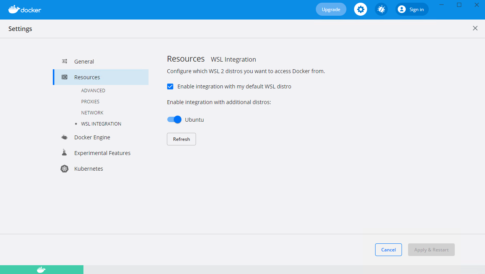
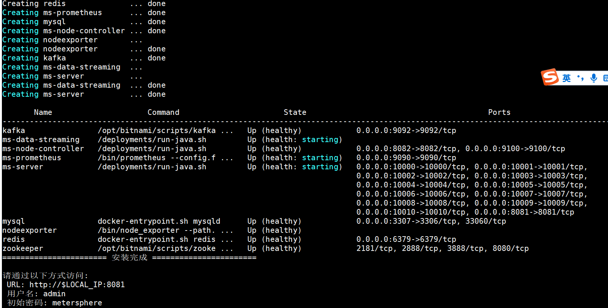

## 1 环境要求

!!! info ""
	得益于 Docker 跨平台应用，MeterSphere 理论上可以部署在任何可以运行 Docker 的宿主机。  
	我们并非是只支持 Linux 操作系统，我们是支持可以部署 Docker 的任意 x86_64 的宿主机（Windows / Linux / macOS）。  
	**本文将以 Windows 10 为例介绍如何在 Windows 10 上安装 MeterSphere。**

!!! info "注意："
	* 云虚拟机可能不支持，需要嵌套虚拟化
	* 物理机可以，Hyper-V 支持嵌套虚拟化  

!!! info "部署服务器要求："
    * 操作系统: 可运行 Docker 的 Windows 操作系统
    * CPU/内存: 4核8G
    * 磁盘空间: 200G

## 2 安装部署

### 2.1 安装 WSL

!!! info ""
	参考[在 Windows 10 上安装 WSL | Microsoft Docs](https://docs.microsoft.com/zh-cn/windows/wsl/install)此问题，进行 Windows 宿主机的配置。  

	使用管理员身份运行：
	```powershell
	dism.exe /online /enable-feature /featurename:Microsoft-Windows-Subsystem-Linux /all /norestart
	dism.exe /online /enable-feature /featurename:VirtualMachinePlatform /all /norestart
	```

	重启操作系统  

	下载[适用于 x64 计算机的 WSL2 Linux 内核更新包](https://wslstorestorage.blob.core.windows.net/wslblob/wsl_update_x64.msi)

### 2.2 设置 WSL2 为默认

!!! info "以管理员身份执行："
	```powershell
	wsl --set-default-version 2
	```

### 2.3 安装 Ubuntu

!!! info ""
	**在 Windows 10 的应用商店里搜索"Ubuntu"并安装：**

{ width="900px" }


### 2.4 检测 Ubuntu WSL 版本

!!! info "以管理员身份执行："
	```powershell
	wsl.exe -l -v
	```

{ width="900px" }

!!! info ""
	**示例中安装的 Ubuntu Name 为 "Ubuntu"， 如像上图出现 Ubuntu 版本为 1， 则继续执行命令：**
	```powershell
	wsl.exe --set-version Ubuntu 2
	```

	**出现下图结果即为成功：**

{ width="900px" }


### 2.5 安装 Docker

!!! info ""
	**下载[Docker Desktop for Windows](https://desktop.docker.com/win/main/amd64/Docker%20Desktop%20Installer.exe)，如果使用的是 macOS，[Install Docker Desktop on Mac | Docker Documentation](https://docs.docker.com/desktop/mac/install/) 。** 

	安装完成后双击 Docker Desktop Installer.exe 安装即可完成安装。


### 2.6 Docker 设置

!!! info ""
	**Docker Desktop 安装完成后，进入 Settings 界面，选择 Resources 菜单下的 WSL INTEGRATION，按下图设置后，点击右下角的 Apply & Restart 即可。**

{ width="900px" }


### 2.7 下载安装包

!!! info ""
	**请自行下载 MeterSphere 最新版本的离线安装包：** 

    安装包下载链接: https://community.fit2cloud.com/#/products/metersphere/downloads


### 2.8 启动 Ubuntu

!!! info ""
	**在应用商店里，选择 Ubuntu，点击"启动"按钮启动 Ubuntu，并执行命令切换到 root 用户：**

	```shell
	sudo su -
	```

{ width="600px" }


### 2.9 检查 Docker 环境

!!! info ""
	**在 Ubuntu 命令行中执行命令：**
	```shell
	docker version
	```

	如能像下图一样正常显示 docker 版本信息，则能正常执行 MeterSphere 后续的安装操作，如出现异常，请根据提示信息解决异常问题。

{ width="600px" }


### 2.10 解压安装包

!!! info ""
	**在 Ubuntu 中，以 root 用户执行如下命令：**

	```sh
	# 假设安装包存放路径为 c:\metersphere-offline-installer-v1.20.4-lts.tar.gz
	cd /mnt/c
	# 解压安装包
	tar zxvf metersphere-offline-installer-v1.20.4-lts.tar.gz
	```

### 2.11 配置安装参数（可选）

!!! info "安装配置文件说明, 如果无特殊需求可以不进行修改采用默认参数安装"
	**MeterSphere 支持以配置文件的形式来设置安装参数，如安装目录、服务运行端口、数据库配置参数等，安装前修改安装包中的 install.conf 文件可完成配置。<br>
	具体参数说明见：[安装配置文件说明](../offline_installation/#42)**

### 2.12 执行安装脚本

!!! info ""
	```sh
	# 进入安装包目录
	cd metersphere-offline-installer-v1.20.4-lts
	# 运行安装脚本
	/bin/bash install.sh
	```


!!! info "注意"
	**如果使用外部数据库进行安装，推荐使用 MySQL 5.7 版本。同时 MeterSphere 对数据库部分配置项有要求，请参考下附的数据库配置，修改环境中的数据库配置文件。<br>
	具体参数说明见：[安装配置文件说明](../offline_installation/#43)**

    请参考文档中的建库语句创建 MeterSphere 使用的数据库，metersphere-server 服务启动时会自动在配置的库中创建所需的表结构及初始化数据。
    ```mysql
    CREATE DATABASE `metersphere` /*!40100 DEFAULT CHARACTER SET utf8mb4 */
    ```


!!! info "安装目录结构说明"
    ```
    /opt/metersphere/
    ├── bin                                         #-- 安装过程中需要加载到容器中的脚本
    ├── compose_files                               #-- 根据不同的安装模式，保存需要使用到的 compose 文件信息
    ├── conf                                        #-- MeterSphere 各组件及数据库等中间件的配置文件
    ├── data                                        #-- MeterSphere 各组件及数据库等中间件的数据持久化目录
    ├── docker-compose-base.yml                     #-- MeterSphere 基础 Docker Compose 文件，定义了网络等基础信息 
    ├── docker-compose-kafka.yml                    #-- MeterSphere 自带的 Kafka 所需的 Docker Compose 文件
    ├── docker-compose-mysql.yml                    #-- MeterSphere 自带的 MySQL 所需的 Docker Compose 文件
    ├── docker-compose-node-controller.yml          #-- MeterSphere Node-Controller 组件所需的 Docker Compose文件
    ├── docker-compose-server.yml                   #-- MeterSphere Server 及 Data-Streaming 所需的 Docker Compose文件
    ├── docker-compose-redis.yml                    #-- MeterSphere Redis 组件所需的 Docker Compose文件
    ├── docker-compose-prometheus.yml               #-- MeterSphere Prometheus 组件所需的Docker Compose 文件
    ├── install.conf -> /opt/metersphere/.env       #-- MeterSphere 的配置文件 /opt/metersphere/.env 的软链接
    ├── logs                                        #-- MeterSphere 各组件的日志文件持久化目录
    └── version                                     #-- 安装包对应的 MeterSphere 版本信息
    ```


!!! info ""
	**安装成功后，通过浏览器访问如下页面登录 MeterSphere**

	```
	地址: http://目标服务器IP地址:服务运行端口
	用户名: admin
	密码: metersphere
	```

{ width="900px" }
