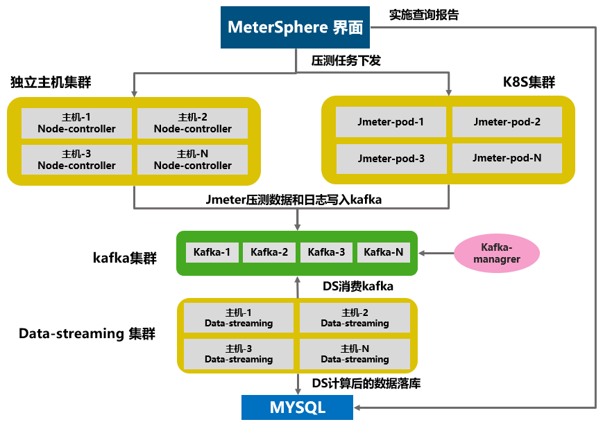

MeterSphere大规模的性能压测主要取决于三个组件：

■ Node controller: 为性能测试提供独立节点类型的测试资源池, 接收来自系统的性能测试任务, 动态的启动 JMeter容器完成性能测试 
■ Data streaming: 从 Kafka 中获取性能测试结果数据进行处理后存入 MySQL 数据库 
■ Kafka: 接收 JMeter 产生的性能测试结果数据 

所以如果需要进行大规模（5000vu以上）的性能测试，需要对上诉三个组件进行水平扩容操作。具体架构如下： 
{:height="100%" width="70%"}  

依据架构所示，需要独立部署kafka集群和data-streaming集群（kafka和data-streaming可以部署在一起），如果采用独立主机压测，还需要部署node-controller集群。部署步骤: 
■ 部署kafka集群  
■ 部署data-streaming集群  
■ 部署node-controller集群  

