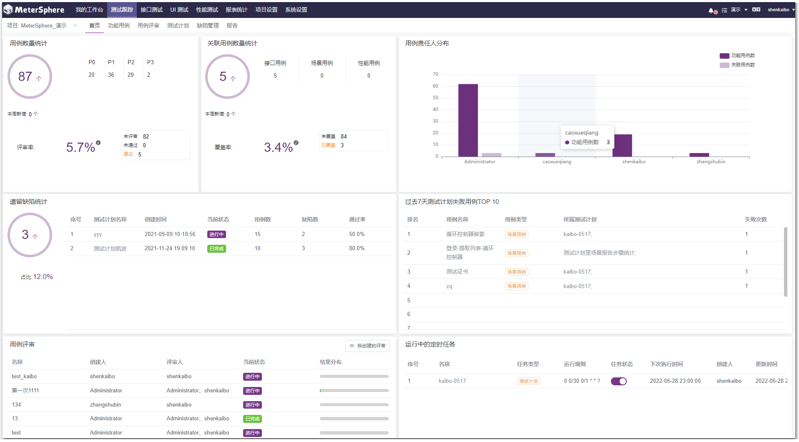

我们准备了可以快速部署 MeterSphere 所有组件及所需的中间件的在线安装脚本, 您可以通过该脚本部署并体验 MeterSphere 所提供的功能。

!!! warning "注意"
    快速安装脚本所部署的环境仅适用于测试体验目的, 生产环境请参考本文档[「在线安装」](../installation/online_installation.md)章节内容进行部署。

## 部署服务器要求

!!! info "部署服务器要求"
     * 操作系统：任何支持 Docker 的 Linux x64
     * CPU/内存：4核 8G
     * 部署目录空间（默认/opt目录）： 20G
     * 网络要求：可访问互联网

## 安装步骤

### 执行快速安装脚本

以 root 用户 ssh 登录目标服务器, 执行如下命令。

```sh
curl -sSL https://github.com/metersphere/metersphere/releases/latest/download/quick_start.sh | sh
```

安装脚本默认使用 /opt/metersphere 目录作为安装目录，MeterSphere 的配置文件、数据及日志等均存放在该安装目录。

!!! warning "注意"
    如果需要使用 Nginx、Haproxy 等反向代理，需要配置反向代理对 websocket 的支持。以 Nginx 为例，参考的配置内容如下。
    ```
    server {
        listen 80;
        server_name demo.metersphere.com;
        server_tokens off;
        return 301 https://$host$request_uri;
    }
    server {
        listen 443 ssl;
        # RSA certificate
        ssl_certificate /etc/nginx/ssl/metersphere.com/fullchain.cer; # managed by Certbot
        ssl_certificate_key /etc/nginx/ssl/metersphere.com/metersphere.com.key; # managed by Certbot
        server_name  demo.metersphere.com;
        proxy_connect_timeout       300;
        proxy_send_timeout          300;
        proxy_read_timeout          300;
        send_timeout                300;
        proxy_set_header Host $host;
        proxy_set_header X-Forwarded-For $remote_addr;
        proxy_set_header X-Forwarded-Host $server_name;
        proxy_set_header X-Real-IP $remote_addr;
        proxy_set_header X-Forwarded-Proto $scheme;
        proxy_redirect http:// $scheme://;
        
        location / {
            proxy_pass http://ip:8081;
            client_max_body_size 1000m;
            #access_log off;
            
            # 配置 websocket 支持
            proxy_http_version 1.1;
            proxy_set_header Upgrade $http_upgrade;
            proxy_set_header Connection "upgrade";
        }
    }
    ```

## 登录并使用

### 登录

安装成功后，通过浏览器访问如下页面登录 MeterSphere。

```
地址: http://目标服务器IP地址:8081
用户名: admin
密码: metersphere
```

### 界面说明


