MeterSphere UI 测试模块提供了元素库、UI自动化、测试报告等UI测试相关功能。 用户可以在该模块中按照树状的功能模块来组织管理项目下的UI自动化场景，同时对已添加的场景进行执行，生成测试报告。

## 1 企业版试用
UI 测试模块 属于企业版（X-Pack）功能，本地部署的用户企业版试用请点击：[申请企业版试用](../../enterprise/)。

## 2 在线体验环境
在线体验环境:
https://www.metersphere.com/

## 3 注意事项

!!! info "UI自动化测试工作前注意事项"
    1.修改 /opt/metersphere/.env 文件，MS_SELENIARM_ENABLED=true 修改配置后加载配置文件执行 msctl reload 
    2. docker ps 检查 local-selenium-grid 容器是否成功启动 
    3.在 MeterSphere 系统参数设置中修改 selenium-docker 地址为http://local-selenium-grid:4444 
    4. UI测试用例，默认 "性能模式" 没有截图展示，关掉 "性能测试" 可以查看每个步骤的截图

## 4 创建模块
MeterSphere 通过模块树的方式组织管理场景，用户可以在左侧查看到UI自动化场景的模块树。 点击左侧的模块树中的 添加模块 按钮，为该项目添加模块。
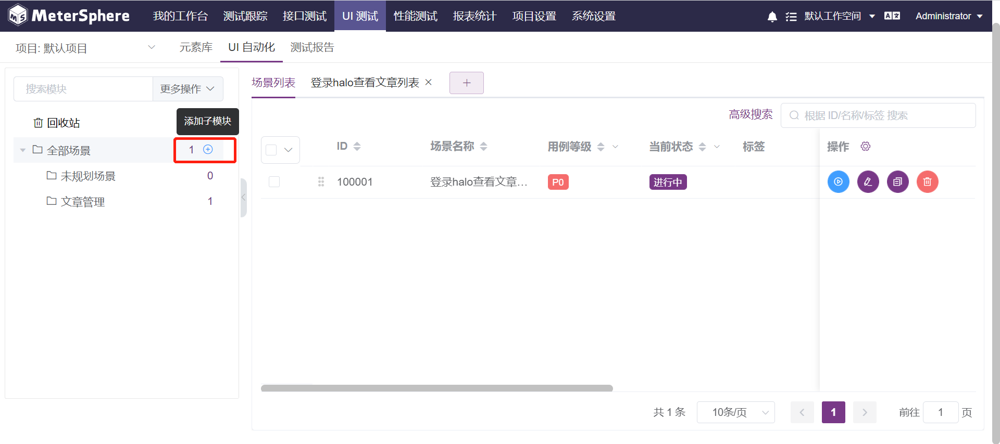

## 5 创建元素
点击左侧的模块树中的 添加子模块 按钮，添加模块，然后创建元素。元素库可用于场景步骤中元素的选择。
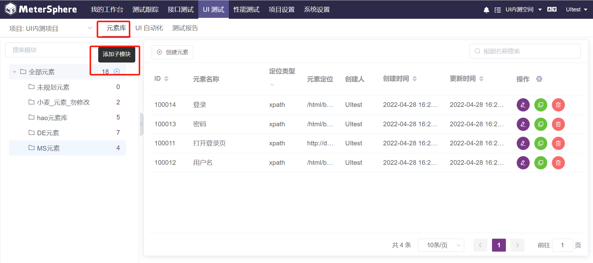

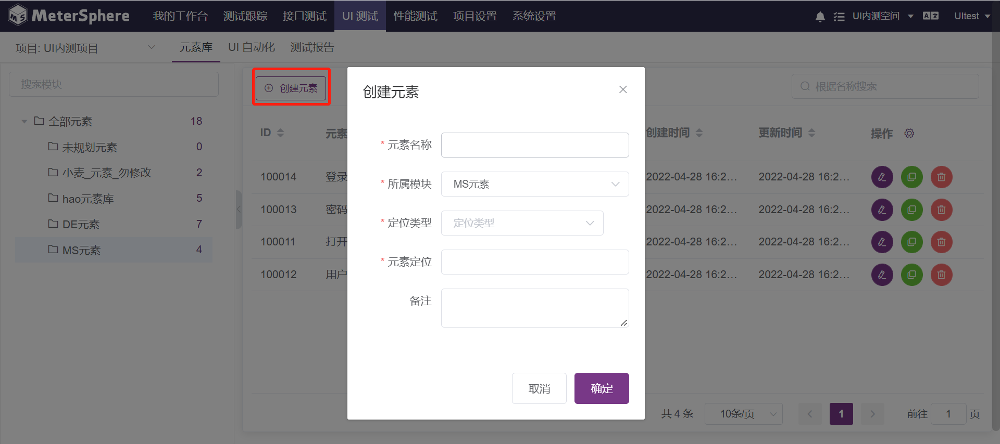

## 6 创建场景
用户即可在各个模块中添加场景，可以手动创建，也可以通过导入的方式创建UI自动化场景。

### 6.1 导入SelenumIDE脚本
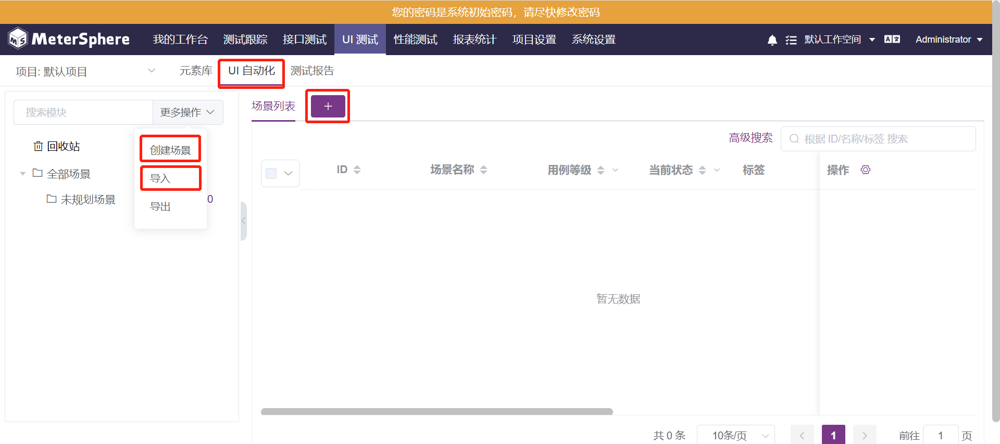

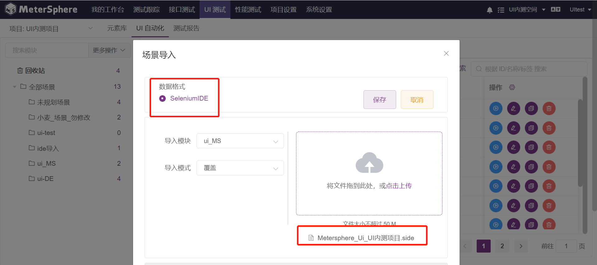

### 6.2 手动创建场景
6.2.1 点击右侧场景列表中的 `创建场景` 按钮。
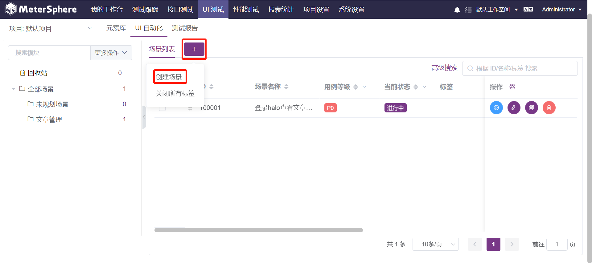

6.2.2 在弹出的用例编辑页面中填写名称、模块、状态、责任人等详细信息。
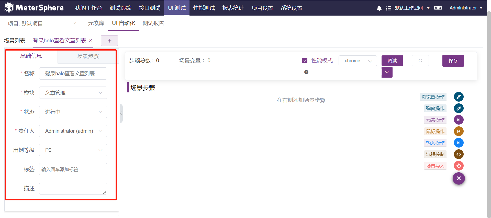

6.2.3 点击页面右侧相应的操作类型，可以添加场景步骤，场景步骤中的操作对象可以选择元素对象或者元素定位，元素对象是从元素库中选取配置好的元素，元素定位需要用元素定位的方式去定位元素。
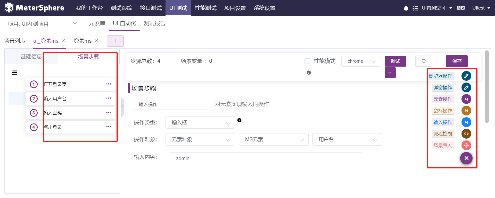

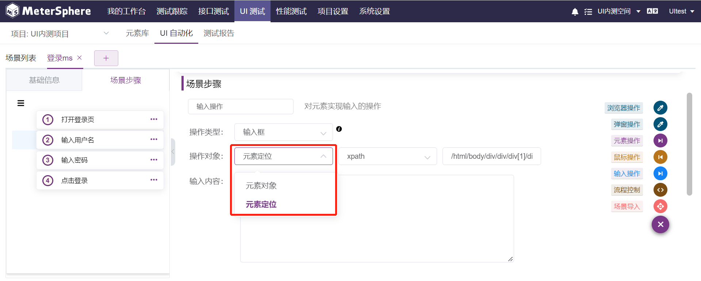

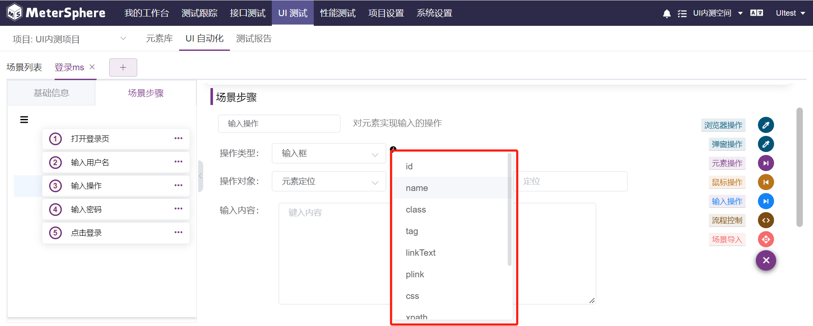

## 7 在场景步骤中添加高级设置
在高级设置中，以后置操作为例，选择 后置操作 ，点击下拉框，选择需要的方式，点击添加。可以添加后置脚本，等待时间，断言和后置提取。
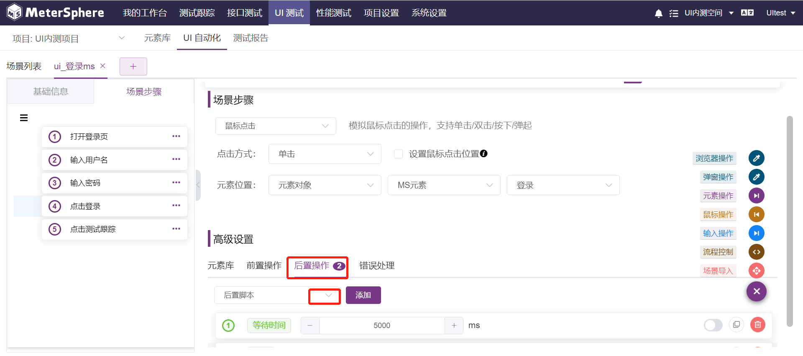

## 8 调试UI自动化场景
可在编辑场景页面调试UI场景，也可以在UI自动化场景列表页面执行UI场景。
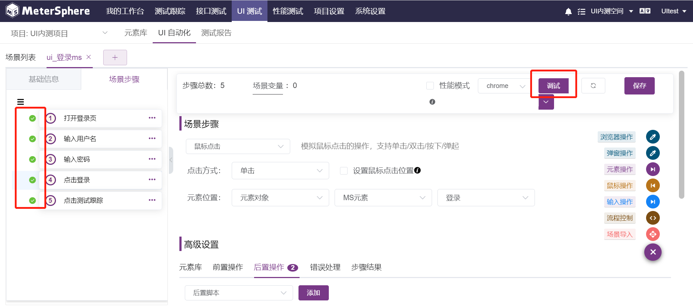

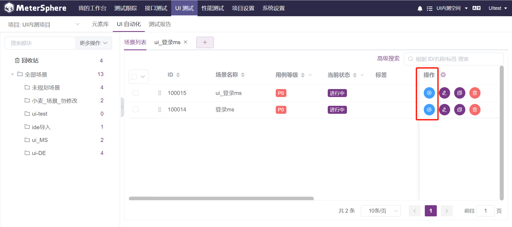

## 9 生成测试报告
点击场景列表中执行按钮，会弹出页面显示本次场景的执行结果。也可通过测试报告页面的报告详情查看测试报告。

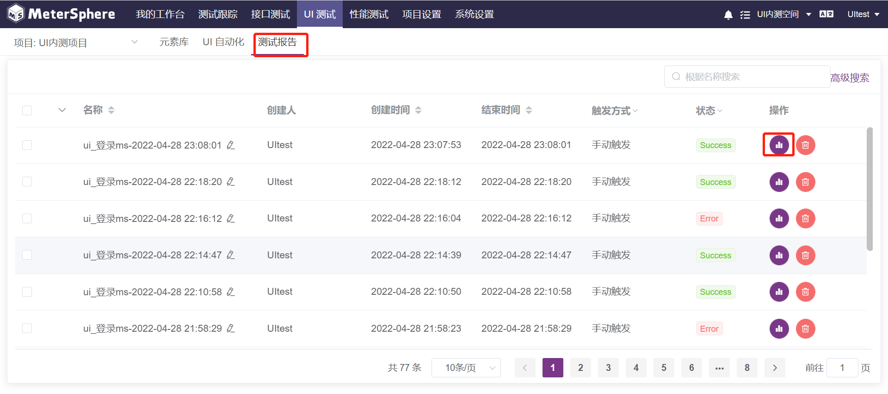