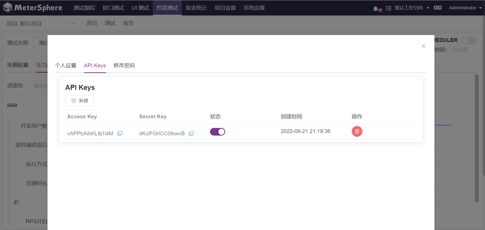
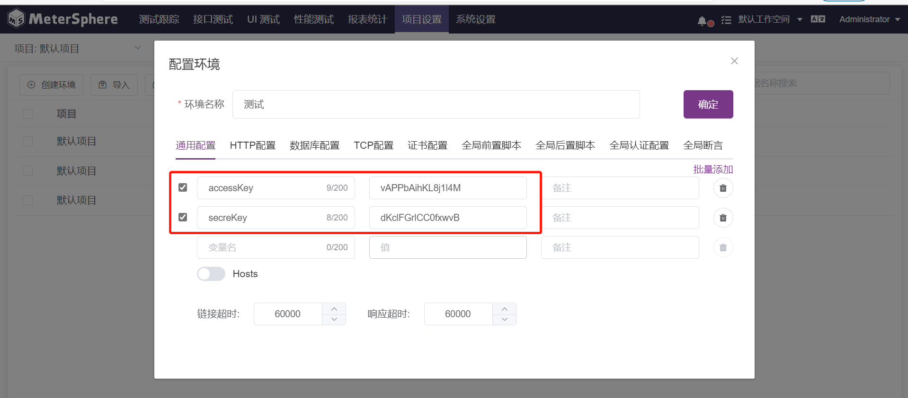
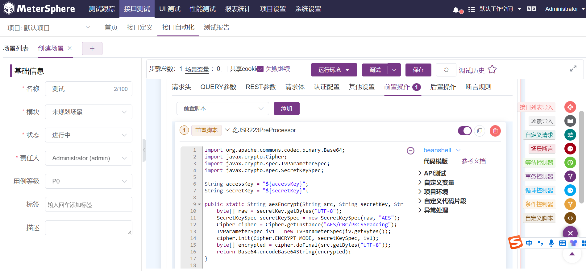
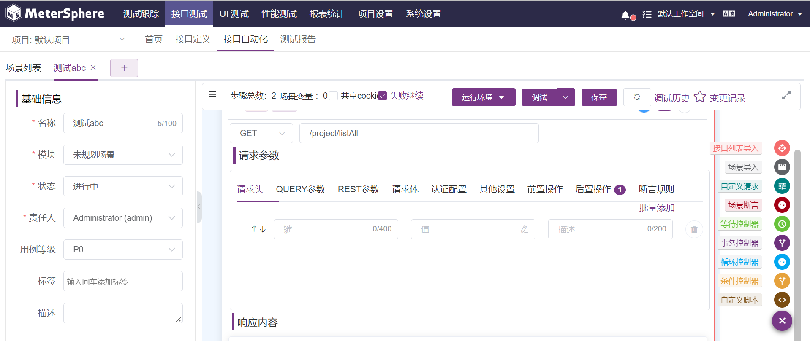
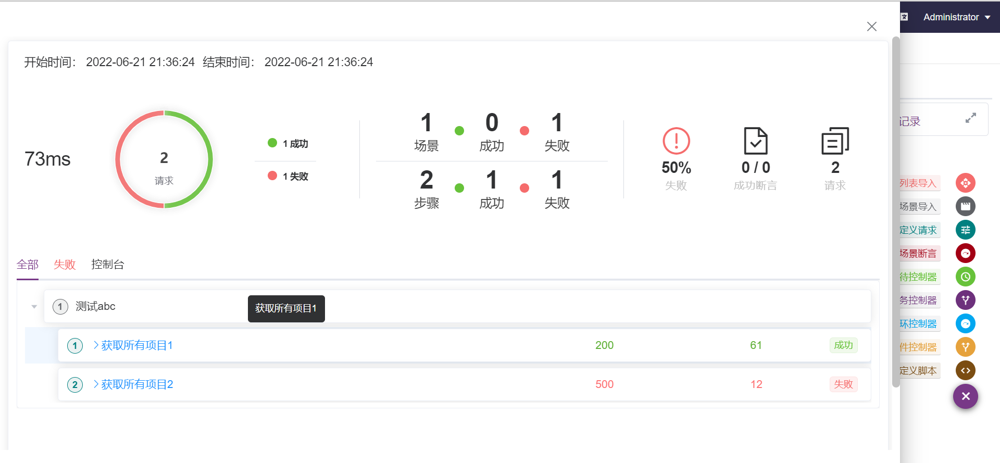

## 前言
目前许多系统的 API 都通过 accessKey + secretKey 生成签名的方式来完成认证，对于这样的接口请求，我们可以先使用脚本生成一个签名后再将其添加到 MeterSphere 的自定义变量中，但是大部分系统的签名信息都与当前时间或请求参数有关，如果每次都需要去执行额外的脚本进行生成就显得十分麻烦。接下来我们就以 MeterSphere 自己的 API 接口为例，介绍一下如何在 MeterSphere 中通过预执行脚本的功能，自动为接口请求生成认证签名。

## MeterSphere API 认证机制


如图所示，我们可以在 MeterSphere 的 “个人信息”→“API keys“ 页面创建 API 认证密钥。通过 API 调用 MeterSphere 接口时需要在请求头中传入 accessKey 及 signature 请求头，其中 accessKey 即为创建 API Key 时生成的 Access Key，signature 通过如下加密算法得出。

> 加密算法：AES
> 加密模式：CBC
> 填充方式：PKCS5Padding
> 加密字符串：Access Key|当前时间戳  (生成的签名只在特定的时间范围内有效，默认30分钟)
> 加密密钥：创建 API Key 时生成的 Secret Key
> AES IV：创建 API Key 时生成的 Access Key

## 操作步骤
在 MeterSphere 创建接口测试，并在场景配置中添加 API 认证需要用到的 accessKey 和 secretKey 作为自定义变量。


在该场景中添加一个 HTTP 请求，调用 GET/project/listAll 获取项目列表接口，在该请求的前置脚本中，添加以下代码生成签名并将签名值存入 signature 变量中。


### BeanShell 脚本例子
BeanShell 脚本例子，通过 Access Key，Secret Key 的方式生成签名，调用 MeterSphere API
```
import org.apache.commons.codec.binary.Base64;
import javax.crypto.Cipher;
import javax.crypto.spec.IvParameterSpec;
import javax.crypto.spec.SecretKeySpec;
 
String accessKey = "${accessKey}";
String secretKey = "${secretKey}";
 
public static String aesEncrypt(String src, String secretKey, String iv) throws Exception {
    byte[] raw = secretKey.getBytes("UTF-8");
    SecretKeySpec secretKeySpec = new SecretKeySpec(raw, "AES");
    Cipher cipher = Cipher.getInstance("AES/CBC/PKCS5Padding");
    IvParameterSpec iv1 = new IvParameterSpec(iv.getBytes());
    cipher.init(Cipher.ENCRYPT_MODE, secretKeySpec, iv1);
    byte[] encrypted = cipher.doFinal(src.getBytes("UTF-8"));
    return Base64.encodeBase64String(encrypted);
}
  
try {
    //调用加密算法生成签名
    String signature = aesEncrypt(accessKey + "|" + System.currentTimeMillis(), secretKey, accessKey);
    //将签名值存入 signature 变量中
    vars.put("signature",signature);
} catch (Exception e) {
    e.printStackTrace();
}
```
### Python 脚本例子
Python 脚本例子，通过 Access Key，Secret Key 的方式生成签名，调用 MeterSphere API
```python3.7
import logging
import time
import requests
from Crypto.Cipher import AES
from base64 import b64encode


class AESCrypt(object):

    def __init__(self, akey, skey):
        self.akey = akey
        if len(skey) != 16:
            raise RuntimeError("密钥长度非16位")
        self.key = str(skey).encode('utf-8')
        self.iv = str(akey).encode('utf-8')
        self.MODE = AES.MODE_CBC
        self.block_size = AES.block_size

        self.padding = lambda s: (s + (self.block_size - len(s) % self.block_size) * chr(self.block_size - len(s) % self.block_size))
        self.unpadding = lambda data: data[:-ord(data[len(data) - 1:])]

    def aes_encrypt(self, plaintext):
        try:
            cryptor = AES.new(key=self.key, mode=self.MODE, IV=self.iv)
            pad_pkcs5 = self.padding(plaintext).encode()
            encrypt_aes = cryptor.encrypt(pad_pkcs5)
            encrypt_text_str = b64encode(encrypt_aes).decode('utf-8')
            return encrypt_text_str
        except Exception as e:
            logging.exception(e)

    def action(self):
        t = time.time()
        e = self.aes_encrypt(f"{self.akey}|{int(round(t * 1000))}")  # 加密
        return e


if __name__ == '__main__':
    accessKey = "${accessKey}";
    secretKey = "${secretKey}";

    signature = AESCrypt(accessKey,secretKey).action()
    //将签名值存入 signature 变量中
    vars.put("signature",signature);
```


在该请求中添加 accessKey 及 signature 两个请求头，accessKey 的值为在场景中配置的 accessKey 变量，signature 的值为上一步通过前置脚本计算出来的签名。


在该场景中再次添加一个 HTTP 请求作为对比，同样调用 GET /project/listAll 接口，不添加 accessKey 及 signature 请求头。


保存并执行该接口测试，在生成的报告中可以看到，添加了认证请求头的接口调用成功，没有添加认证请求头的接口调用失败。



