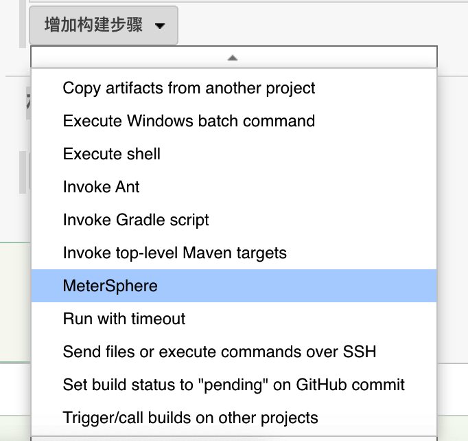
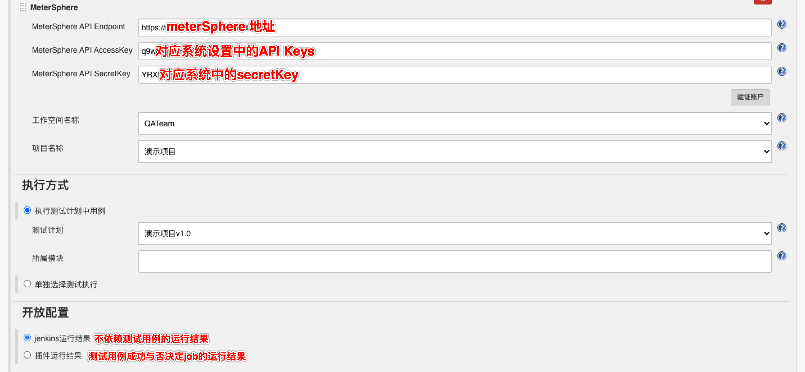
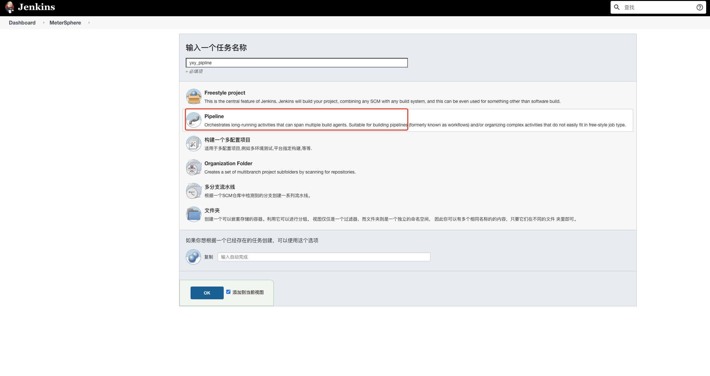
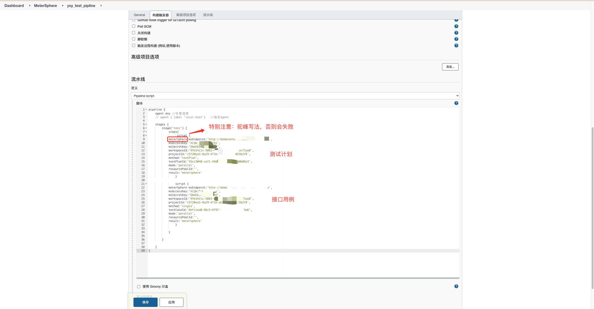
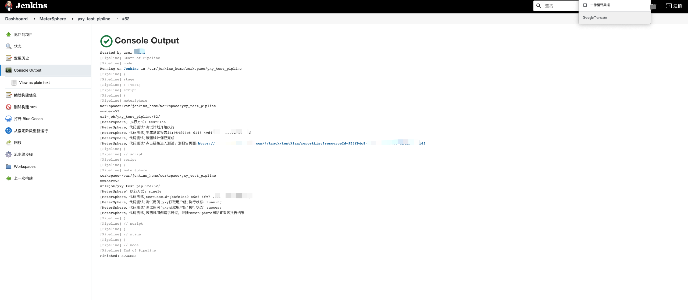
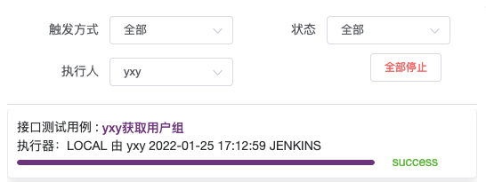
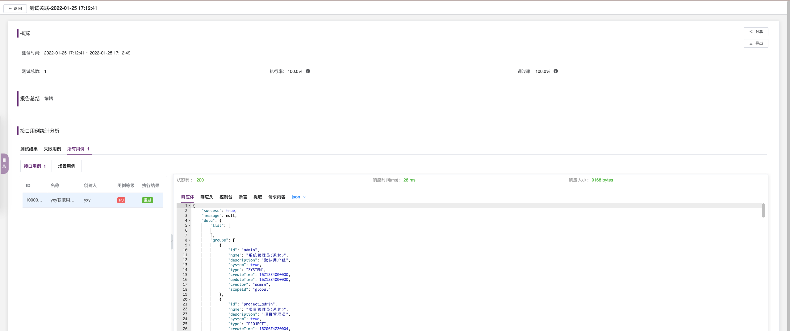

## 插件下载

要想实现在 Jenkins 中完成 MeterSphere 自动化接口测试，需要在 Jenkins 上安装 MeterSphere 提供的 Jenkins 插件。
```
插件下载地址: https://github.com/metersphere/jenkins-plugin/releases
下载对应版本的 hpi 包，在 Jenkins 的插件管理页面，上传并安装下载好的 hpi 插件包
```

## Jenkins 构建任务

插件安装后，在指定的 Jenkins 构建任务中，添加「MeterSphere」类型的构建步骤


通过配置 MeterSphere 认证信息，并指定需要触发执行的接口测试、性能测试或测试计划。


## Jenkins 创建 Pipeline 任务

安装完成后，可以在 Jenkins 中创建 Pipeline 任务了，点击“新建Item”后，在该页面输入任务名称，并选择“Pipeline”类型，点击“OK”按钮，即可完成一个 Pipeline 任务的创建。


### 1. 编写脚本
Jenkins Pipeline 目前支持两种语法模式，即 Declarative 声明式（在 Pipeline Plugin 2.5 中引入）和 Scripted Pipeline 脚本式。关于这两种模式的差异可以进一步参考Jenkins的官方文档（https://www.jenkins.io/doc/book/pipeline/#pipeline-syntax-overview）。

以 Declarative 声明式语法为例，接下来我们将介绍如何在 Jenkins Pipeline 中使用 eterSphere 插件。
```
MeterSphere插件共提供了以下参数供用户进行配置：

msEndpoint：MeterSphere服务地址（例如：https://demo.metersphere.com）；
msAccessKey：MeterSphere上某个用户的API Access Key；
msSecretKey：上述Access Key对应的Secret Key；
workspaceId：需要触发执行的测试所在的工作空间id；
projectId：需要触发执行的测试所在的项目id；
method：触发执行的任务类型（testplan：执行整个测试计划，single：执行指定的某个测试任务）；
testPlanId：测试计划id，method参数值为testplan时有效；
testCaseId：场景id/接口用例id/性能测试id，method参数值为single时有效；
mode：执行方式（serial：串行执行，parallel：并行执行）；
resourcePoolId：执行测试使用的测试资源池id。
```
由于插件实现方式的问题，MeterSphere 插件目前还不支持在声明式 Pipeline 中的直接引用。我们可以在声明式 Pipeline 中引入 Script 步骤， 然后在 Script 步骤块中引用 MeterSphere 插件。

具体如下图所示。


代码块如下:
```
pipeline {
    agent any //任意选择
    // agent { label 'local-host'}   //指定agent
 
    stages {
        stage('Build') {
            steps{
                echo "building"
            }
        }
        stage('Deploy') {
            steps{
                echo "deploying"
            }
        }
        stage('Test') {
            steps{
                 script {
                    meterSphere msEndpoint:'http://XXXX',
                    msAccessKey:'XXXXXX',
                    msSecretKey:'XXXXXX',
                    workspaceId:'XXXXXX',
                    projectId:'XXXXXX',
                    method:'testPlan',
                    testPlanId:'XXXXXX',
                    mode:'parallel',
                    resourcePoolId:'',
                    result:'metersphere'
                }
  
                script {
                    meterSphere msEndpoint:'http://XXXXXX',
                    msAccessKey:'XXXXXX',
                    msSecretKey:'XXXXXX',
                    workspaceId:'XXXXXX',
                    projectId:'XXXXXX',
                    method:'single',
                    testCaseId:'XXXXXX',
                    mode:'parallel',
                    resourcePoolId:'',
                    result:'metersphere'
                }
            }  
        }
    }
}
```
注意：Pipeline 脚本可以直接写在编辑任务页面中；也可以存放在 Git 仓库的指定位置，在配置任务时再进行指定。

### 2. 构建任务
Jenkins 任务创建完成后可以点击“手动构建”按钮查看效果。在构建任务的控制台日志中，可以看到指定的测试计划和接口用例已经执行完成。


同时，我们进入 MeterSphere 持续测试平台进行查看，也可以看到接口测试已经执行成功，且测试计划报告已经生成。

① 接口用例执行结果；


② 测试计划报告已经生成。
