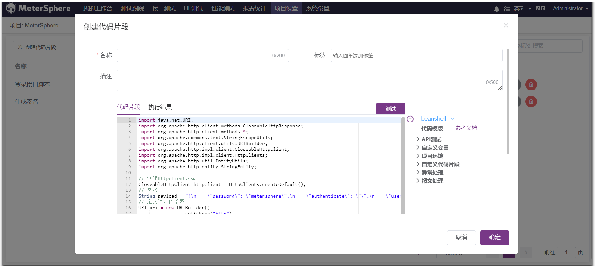
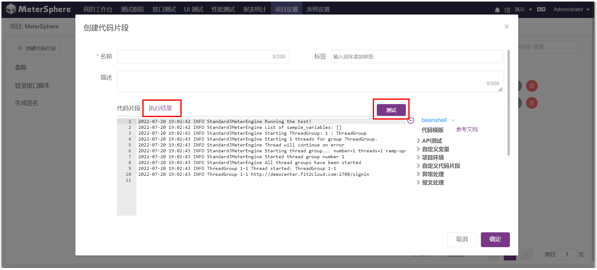
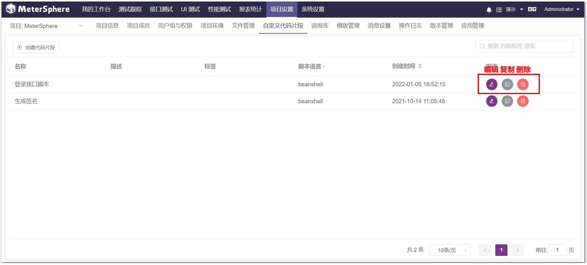
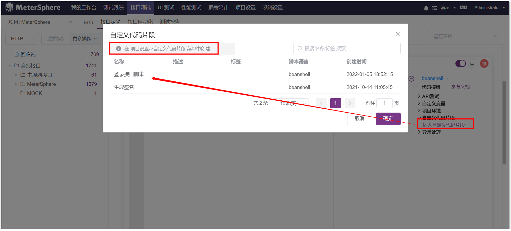

在接口自动化中经常需要添加前后置脚本及自定义脚本，通过新增的自定义代码片段功能，用户可以将常用的脚本保存下来，在需要使用的地方直接添加即可。

## 自定义代码片段维护
选择 `项目设置->自定义代码片段`。

点击 `创建代码片段` ，可以把常用的代码写这里。

点击 `测试` 可以校验此代码执行的情况。

点击 `确定` 创建的代码片段保存在代码列表中。

同时系统提供相关的管理功能：编辑、复制和删除等，对代码片段进行管理。

## 自定义代码片段使用
代码片段维护好后，在 `接口、场景测试用例` 或者 `环境` 的 `前置脚本、后置脚本` 中，选择 `插入自定义代码片段` 可以直接引用此代码，以 `接口测试用例` 为例。

