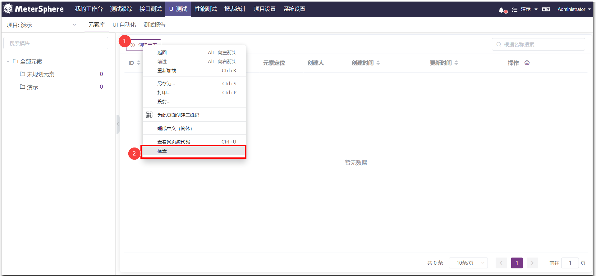
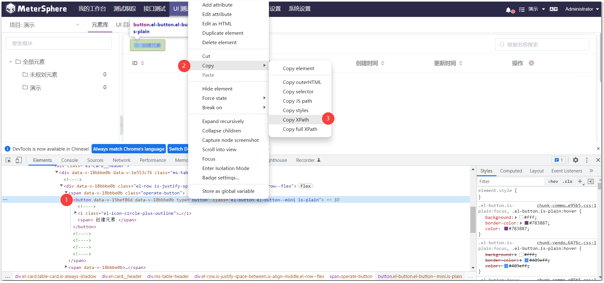
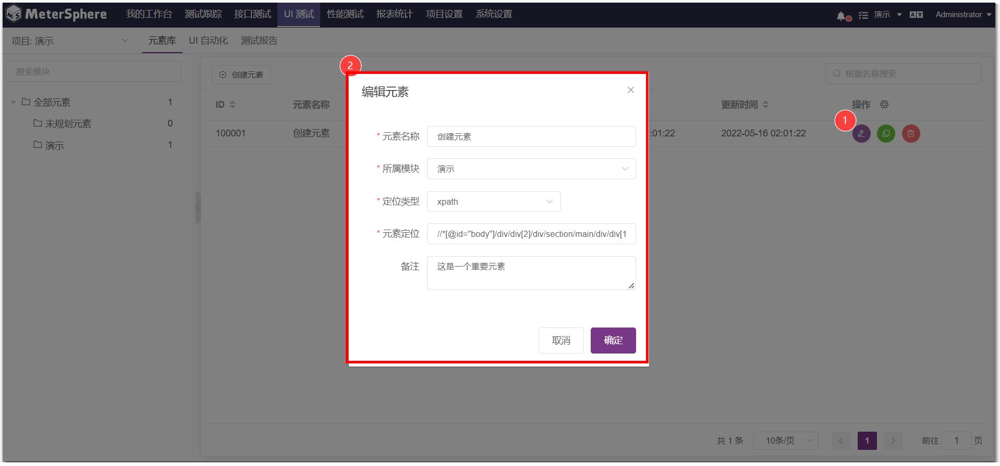
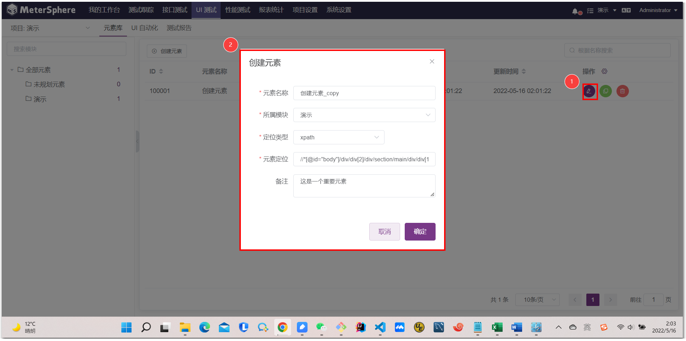
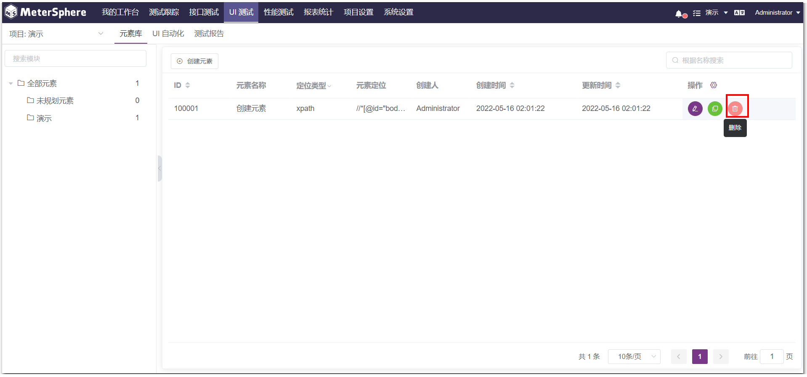

## 1 创建元素
切换到“UI测试”模块下的“元素库”页面，点击“创建元素”，输入元素字段名，选择所属模块和定位类型，然后输入元素定位的表达式和备注。

## 2 元素定位
元素定位支持多种方式，包括id、name、class、tag、link、plink、css、xpath、lable、value、index，这里我们以XPath为例。输入必填信息后，点击确认即可保存元素。

在页面上点击你要定位的元素，然后右键选择“检查”

右键选择Copy-Copy XPath 即可获得该元素的xpath路径

## 3 编辑元素
在元素库列表，点击“编辑”键，可以修改元素属性，修改之后点击确认即可保存。

## 4 复制元素

## 5 删除元素
